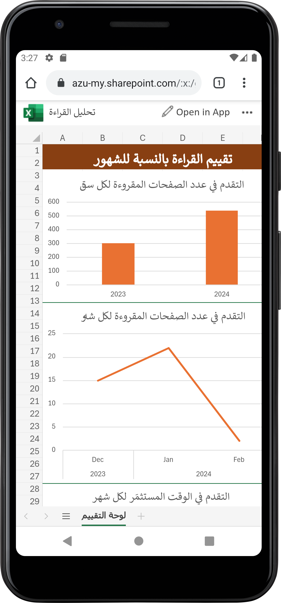
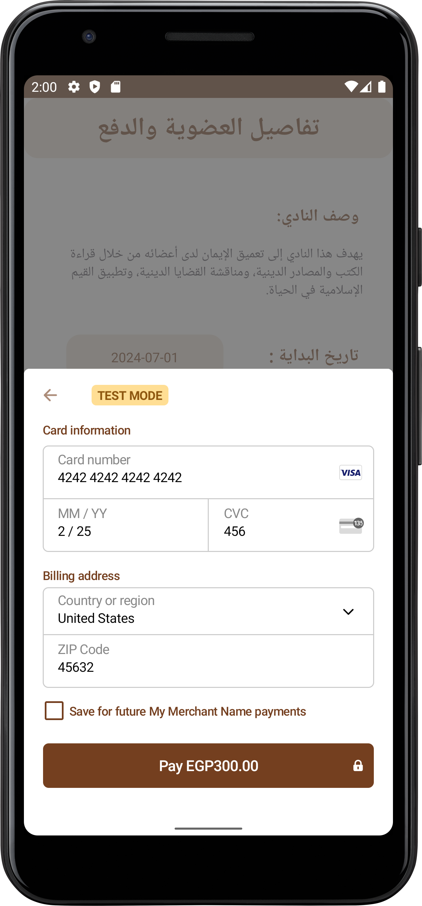
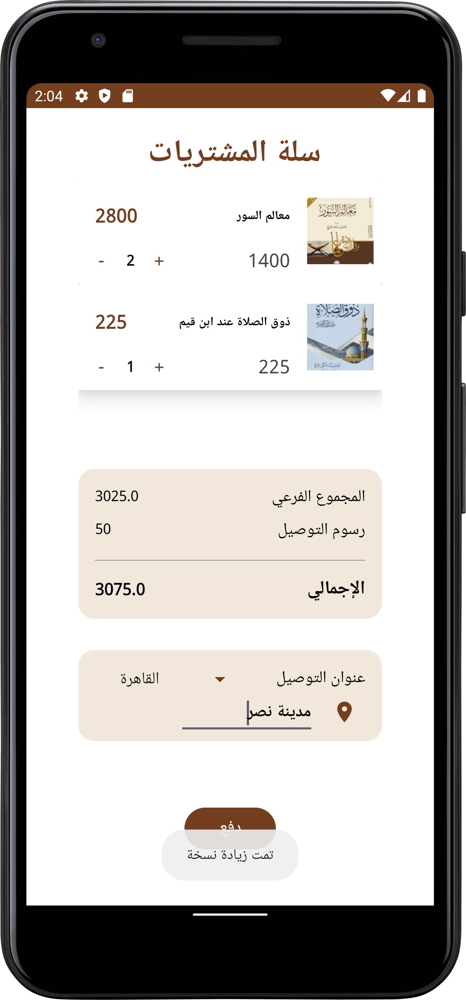

# 📚 Speaking Pages Android App

**Speaking Pages** is an AI-powered Android and web application that creates an interactive and inclusive community for readers. It offers innovative features like book clubs, AI-generated audiobooks, chat assistance, and a built-in marketplace to enhance and modernize the reading experience. 

---

## 🔑 Key Features

- **📚 Book Clubs:**  
  Join or create clubs based on interests like religion, literature, and culture. Each club is moderated by a supervisor and consultant, offering curated book lists and periodic online discussions.

- **🔊 Audiobooks using AI:**  
  Instantly convert PDF books into audio using AI, providing better accessibility for visually impaired users or those who enjoy listening.

- **🗨️ Real-Time Discussions:**  
  Engage in live book conversations using **Socket.IO** to create an active, connected reading community.

- **🛒 Book Marketplace:**  
  Buy and sell new or used books directly within the app. Secure payments are handled via **Stripe Payment Sheet** integration.

- **📍 Library Locator:**  
  Discover nearby libraries with map integration and get directions using **Google Maps API**.

- **📈 Reading Tracking and Analysis:**  
  Set weekly reading goals, track progress, and analyze reading behavior to improve your habits.

- **💬 Chat Assistant :**  
  Get intelligent answers, reading support, and personalized book recommendations with an integrated AI chat assistant.

---

## ⚙️ Tech Stack

| Layer        | Technology                         |
|--------------|-------------------------------------|
| **Mobile App** | Android Studio, Kotlin              |
| **Frontend**   | React.js                            |
| **Backend**    | Flask (Python)                      |
| **Database**   | MySQL                               |
| **Payments**   | Stripe Payment Sheet                |
| **APIs**       | RESTful APIs                        |
| **Real-Time**  | Socket.IO                           |
| **Maps**       | Google Maps API                     |
| **AI**         | TTS Model  (Tacotron2)              |
| **Architecture** | MVVM                              |

## 📸 Screenshots

| Reading Analytics | Book Clubs | Payment |
|-------------|------------|------------------|
|  |  |  |

| Shopping Cart | Books | Library Locator |
|----------------|-------------|------------------|
|  |  |  |

---

## 🎥 Demo

Watch a short demo of **Speaking Pages**:

## App

[▶️ Watch Demo on Google Drive](https://drive.google.com/file/d/1HSEzI0zNYZW1C06MAOEclHGzoJ-9IP2u/view)

## Website

[▶️ Watch Demo on Google Drive](https://drive.google.com/file/d/1a4t505RqH322_RBUmgNSOpM8-EeT0sfI/view)

## Role: Team Leader & Android Developer

Led project planning and coordination, managed team collaboration, and oversaw version control by managing the Git workflow for the mobile application. Developed the Android app using Kotlin and Android Studio, integrating key features including AI-powered TTS through a PDF viewer and MP3 player.

